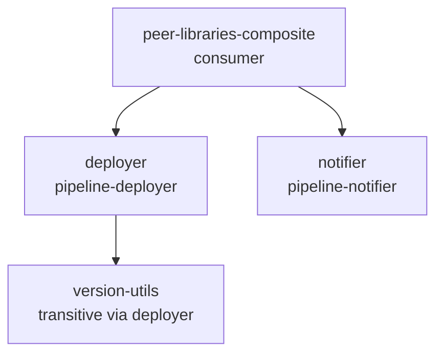

# Peer-libraries composite example

Demonstrates peer library dependencies across separate Gradle builds using composite build (`includeBuild`) and GAV notation.

For the multi-project (`project(":lib")`) variant of peer libraries, see [`peer-libraries/`](../peer-libraries/).
For `libraryName` override and `implicit` controls on a single library, see [`explicit-library-name/`](../explicit-library-name/).

## Purpose

The root project declares `deployer` and `notifier` as peers via their published coordinates (`com.example.pipeline:deployer:1.0` and `com.example.pipeline:notifier:1.0`).
`deployer` itself depends on `version-utils` for a helper step — that transitive peer is pulled in automatically because Gradle composes nested included builds and the `sharedLibrarySourceElements` variant propagates transitively.

## Dependency graph

## Structure

- `deployer/` — provides `deploymentUrl`, declares `version-utils` as a peer
- `notifier/` — provides `buildReport`, standalone
- `version-utils/` — provides `semverLabel`, a simple helper
- `vars/publishRelease.groovy` — consumer vars step that calls all three peers
- `test/integration/java/PublishReleaseTest.java` — exercises the full pipeline

## How the composite wiring works

Each library's `settings.gradle.kts` uses `pluginManagement { includeBuild("../../..") }` to find the plugin.
`deployer/settings.gradle.kts` also includes `version-utils` via `includeBuild("../version-utils")`.
The root only needs `includeBuild("deployer")` and `includeBuild("notifier")` — Gradle composes the nested included build automatically, so `version-utils` is available for GAV substitution without an explicit `includeBuild` here.

Both direct peers are mapped to renamed library names via the DSL: `pipeline-deployer` and `pipeline-notifier`.
