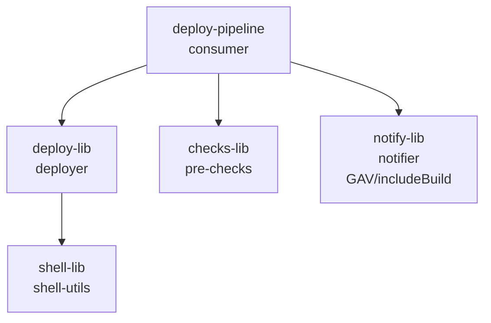

# Peer-libraries example

A consumer library that depends on **three project peers and one GAV peer in the same build** — the most common real-world topology where most of your shared libraries live in one repo and a few come from elsewhere.

For an all-composite (GAV-only) topology across separate Gradle builds, see [`peer-libraries-composite/`](../peer-libraries-composite/).
For `libraryName` + `implicit` controls on a single, non-peer library, see [`explicit-library-name/`](../explicit-library-name/).

## Libraries

| Library | Gradle dep type | Jenkins library name | Implicit | Step |
|---|---|---|---|---|
| `deploy-lib` | `project(":deploy-lib")` | `deployer` | yes | `deployTo(env, service)` |
| `shell-lib` | transitive via `deploy-lib` | `shell-utils` | yes | `runShell(cmd)` |
| `checks-lib` | `project(":checks-lib")` | `pre-checks` | yes | `preCheck(service)` |
| `notify-lib` | GAV via `includeBuild` | `notifier` | **no** | `notifySlack(msg)` |

`notifier` is registered with `implicit = false` to demonstrate the opt-in pattern: pipelines that want notifications must add `@Library('notifier') _` at the top of the Jenkinsfile.

## Dependency graph

The settings file mixes `include(...)` for project peers with `includeBuild(...)` for the GAV peer — this is intentional and supported.

## Cross-library `src/` imports

Peer libraries can reference each other's `src/` classes via plain `import` statements.
See `deploy-lib/vars/restartService.groovy` (vars-level cross-import) and `deploy-lib/src/com/example/deploy/HealthCheck.groovy` (src-to-src cross-import).
Both reference `com.example.shell.ShellStep` from `shell-lib`.

## Tests

Each library has unit tests for its own steps and classes.
The `deploy-pipeline` consumer additionally has:

- **Unit tests** with `BasePipelineTest` (mocking peer steps) and with JPU loading peer libraries for real via `projectSource`.
- **Integration tests** that run the full pipeline in embedded Jenkins, including coverage of cross-library `src/` imports.
