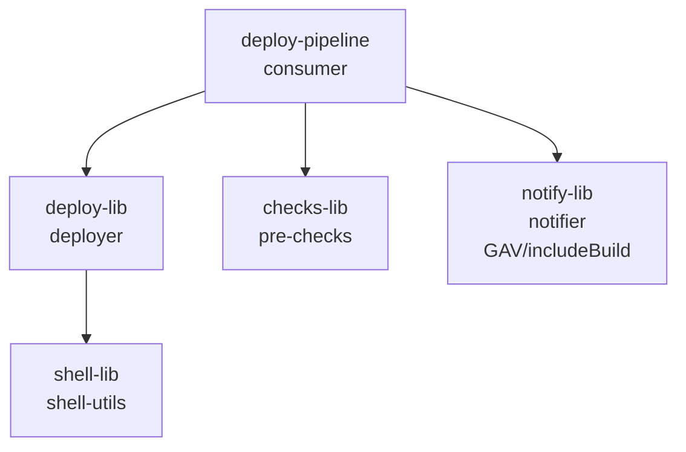

# Peer-libraries example

Demonstrates the peer-library DSL surface in a single build: subproject `project()` deps, an `includeBuild` GAV dep, transitive resolution, custom `libraryName` overrides, the `implicit` toggle, cross-library `src/` imports, and both unit and integration testing patterns.

For an all-composite (GAV-only) topology across separate Gradle builds, see [`peer-libraries-composite/`](../peer-libraries-composite/).
For `libraryName` + `implicit` controls on a single, non-peer library, see [`explicit-library-name/`](../explicit-library-name/).

## Libraries

| Library | Gradle dep type | Jenkins library name | Implicit | Step |
|---|---|---|---|---|
| `deploy-lib` | `project(":deploy-lib")` | `deployer` | yes | `deployTo(env, service)` |
| `shell-lib` | transitive via `deploy-lib` | `shell-utils` | yes | `runShell(cmd)` |
| `checks-lib` | `project(":checks-lib")` | `pre-checks` | yes | `preCheck(service)` |
| `notify-lib` | GAV via `includeBuild` | `notifier` | **no** | `notifySlack(msg)` |

`shell-lib` is only declared by `deploy-lib`; the root picks it up transitively through the `sharedLibrarySourceElements` variant chain.
`notifier` is registered with `implicit = false` to demonstrate the opt-in pattern: pipelines that want notifications must add `@Library('notifier') _` at the top of the Jenkinsfile.
`RunDeployTest.java` shows that.

## Dependency graph

## Cross-library `src/` imports

`deploy-lib` and `shell-lib` each ship classes under `src/`.
A library's vars or src files can import classes from another peer library directly — Jenkins gives every library in a pipeline run the same Groovy classloader, so cross-library type references resolve at runtime without any `@Library` annotation or merged sources.
The plugin wires peer `src/` onto `compileClasspath` so the same imports also compile cleanly under Gradle.

Demonstrated by:
- `deploy-lib/vars/crossImport.groovy` and `deploy-lib/src/com/example/CrossImportSrc.groovy` — both import `com.example.ShellStep` from `shell-lib` with a plain `import`.
- `deploy-pipeline/test/integration/java/CrossLibrarySrcImportTest.java` — runs them inside embedded Jenkins.

The one shape that doesn't work this way is **bidirectional** src/ references (lib A imports lib B *and* lib B imports lib A).
Jenkins would resolve them fine at runtime, but Gradle refuses to schedule the compile graph because A:jar would need to come before B:compileGroovy and vice versa.
The classic workaround is to merge both libraries' sources into one library's directory before compile.

## Tests

Each library has unit tests (pipeline-unit) exercising its own vars in isolation.
The `deploy-pipeline` consumer has:

- `test/unit` — `RunDeployTest.groovy` mocks all four peer steps with `BasePipelineTest` to test orchestration logic without Jenkins.
- `test/unit` — `RunDeployJpuPeerTest.groovy` loads peer libraries *for real* via JPU's `projectSource` retriever, reading peer locations from the `test.library.N.{name,location,implicit}` JVM properties the plugin injects on every test suite.
- `test/integration` — `RunDeployTest.java` runs the full pipeline in embedded Jenkins. `CrossLibrarySrcImportTest.java` covers cross-library `src/` class visibility.
